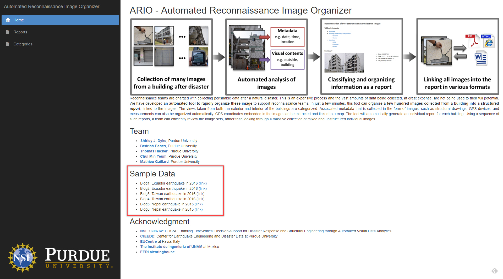

## Example of The ARIO (Automated Reconnaissance Image Organizer) Tool Usage
This example illustrates how to use our ARIO tool. The ARIO tool is developed to organize building reconnaissance images into a structured report. You can generate the report using your own images, or the provided sample sets of images (see the "HOME" tab in ARIO). The tool is being updated so we welcome your feedback and comments. We would ask you to  comment regarding **(1) useful image categories, (2) additional functions, and (3) report layout.** To use this tool, you can follow the text guideline below or watch the instructional video [(Link)](https://youtu.be/iKPt0P9AN4o).

### **Caution**
> * This tool is designed to generate a report for an individual building. You should use a set of pictures collected from the same building when you generate each report.
> * Please do not click the back button in your web browser. 
> * The function for deleting the report is not implemented yet. Please let us know if you want to delete a report.
> * The tool is intended for generating a report for concrete or masonry buildings and will be less accurate for other construction types.    

## Getting Started

### Step 1: Go to the ARIO website 
Click this [**link**](http://vps182404.vps.ovh.ca) or types this address (http://vps182404.vps.ovh.ca) on your web browser (e.g. Chrome, Edge, Firefox)

### Step 2: Log in the ARIO 
You will see the screen below

Please type the following user name and password:

> Username: **ario**   
> Password: **purdue**

### Step 3: Select the building reconnaissance images
You can use your own images or the set of images collected from past earthquake events (see below).

   
Please use the images collected from a **single** building to generate each report. 

### Step 4: Generate your report  

* Click `Reports` on the left.
* You can see the existing report(s) or generate your own report.
* Click the `Add` button on the bottom right.  
* Enter the name you wish to give to the report.
* Click `Choose files...` and select the images that you want to include in the report. Then, click the `upload` button. It takes 0.5~1 second to upload and classify each image. (50 images will take about a minute.) 

### Step 5: View data by category
* Click `Categories` on the left.
* You can see all categorized images that are classified across all reports.     

### Step 6: Export your report as a PDF or HTML
These functions will be implemented in the next version of ARIO. 
